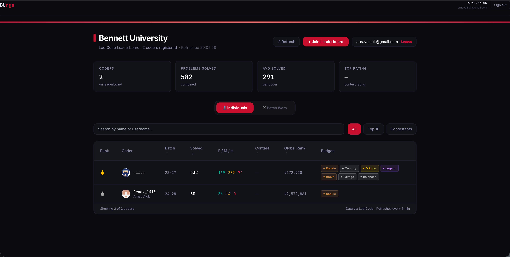
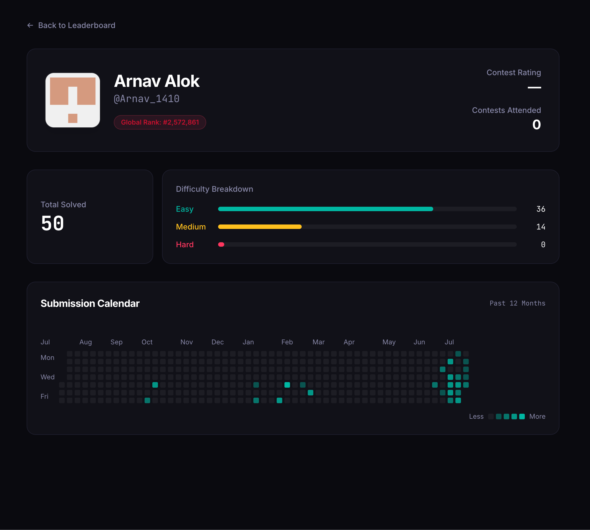
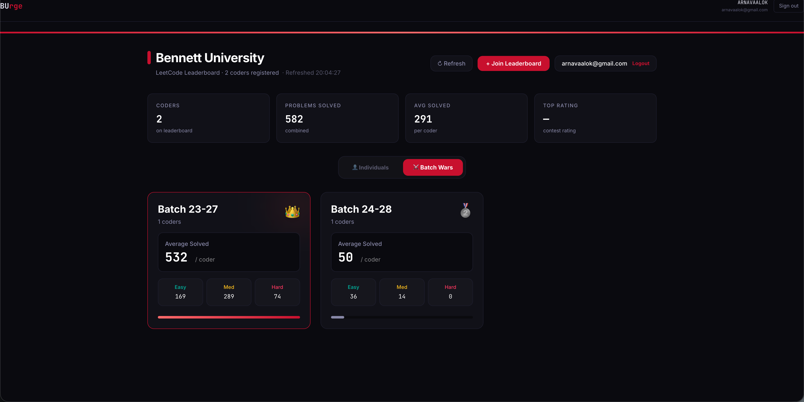
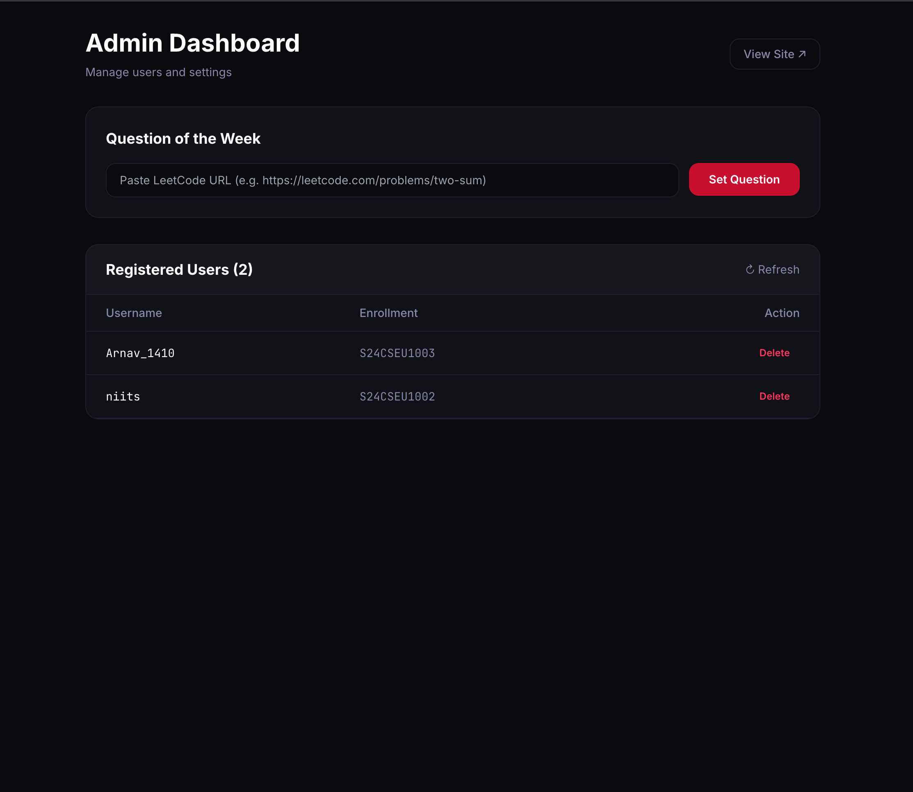
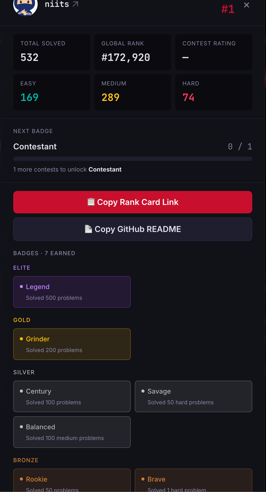

<div align="center">

# 🏆 BUrank

### The modern LeetCode leaderboard platform for universities.

Track competitive programming progress, compare batches, discover top performers, and foster healthy coding competition — all in one place.

[Live Demo](https://www.burank.app) • [Report Bug](https://github.com/Captain-23/burank/issues) • [Request Feature](https://github.com/Captain-23/burank/issues)

</div>

---

## Overview

BUrank is a production-ready platform that enables universities to build an engaging LeetCode leaderboard for their students.

It automatically aggregates LeetCode statistics, provides department-wide rankings, tracks contest performance, and offers administrators an intuitive interface for managing users and weekly challenges.

Built with a modern full-stack architecture, BUrank is fast, responsive, scalable, and completely free to deploy.

---

## ✨ Features

### Live Leaderboard

- Real-time LeetCode rankings
- Easy / Medium / Hard problem breakdown
- Contest rating and global ranking
- Dynamic sorting and filtering

### Batch Wars

- Compare academic batches
- Average solved problems
- Competitive batch rankings
- Encourage healthy peer competition

### Student Profiles

- Individual coding statistics
- Contribution heatmaps
- Contest history
- Achievement overview

### Passwordless Authentication

- Secure email magic links
- University email verification
- Persistent authenticated sessions

### Admin Dashboard

- Student management
- Question of the Week management
- Secure administrator access
- Moderation tools

### Modern User Experience

- Fully responsive
- Dark theme
- Smooth animations
- Skeleton loading states
- Optimized performance

---

# Tech Stack

| Category | Technology |
|-----------|------------|
| Framework | Next.js 14 |
| Language | TypeScript |
| Styling | Tailwind CSS |
| Authentication | NextAuth.js + Resend |
| ORM | Prisma |
| Database | Google Sheets |
| Backend | Google Apps Script |
| Deployment | Vercel |

---

# Screenshots

## Leaderboard

<p align="center">

  

</p>

---

## Student Profile

<p align="center">

  

</p>

---

## Batch Wars

<p align="center">

  

</p>

---

## Admin Dashboard

<p align="center">

  

</p>

---

## Personal Card

<p align="center">

  

</p>

---

# Roadmap

## Completed

- [x] Live Leaderboard
- [x] Student Registration
- [x] Magic Link Authentication
- [x] Admin Dashboard
- [x] Question of the Week
- [x] Student Profiles
- [x] Batch Rankings
- [x] Responsive Design

## In Progress

- 🚧 Complete UI Redesign (v2)
- 🚧 Performance Optimizations
- 🚧 Better Mobile Experience

## Planned

- Achievement System
- University Analytics
- Organization Accounts
- Custom Themes
- Advanced Search
- Student Badges

---

# Project Status

> 🚧 **BUrank v2 is currently under active development.**

The current release is stable and production-ready.

The next major milestone focuses on delivering a complete UI/UX redesign, improved performance, and a richer user experience.

Feedback, ideas, and contributions are always welcome.

---

# Contributing

Contributions are welcome.

Whether you'd like to fix bugs, improve the UI, optimize performance, or suggest new features, we'd love your help.

1. Fork the repository
2. Create a feature branch

```bash
git checkout -b feature/amazing-feature
```

3. Commit your changes

```bash
git commit -m "Add amazing feature"
```

4. Push your branch

```bash
git push origin feature/amazing-feature
```

5. Open a Pull Request

For significant changes, please open an Issue first so we can discuss the proposed direction.

---

# Architecture

```text
                 LeetCode GraphQL
                        │
                        ▼
              Next.js API Routes
                        │
        ┌───────────────┼───────────────┐
        ▼                               ▼
 Google Sheets                    Authentication
 (Student Data)              NextAuth + Resend
        │                               │
        └───────────────┬───────────────┘
                        ▼
                 BUrank Frontend
                  (Next.js + React)
                        │
                        ▼
                     Vercel
```

---

# License

Distributed under the MIT License.

---

<div align="center">

Made with ❤️ for the competitive programming community.

If you found this project useful, consider giving it a ⭐.

</div>
